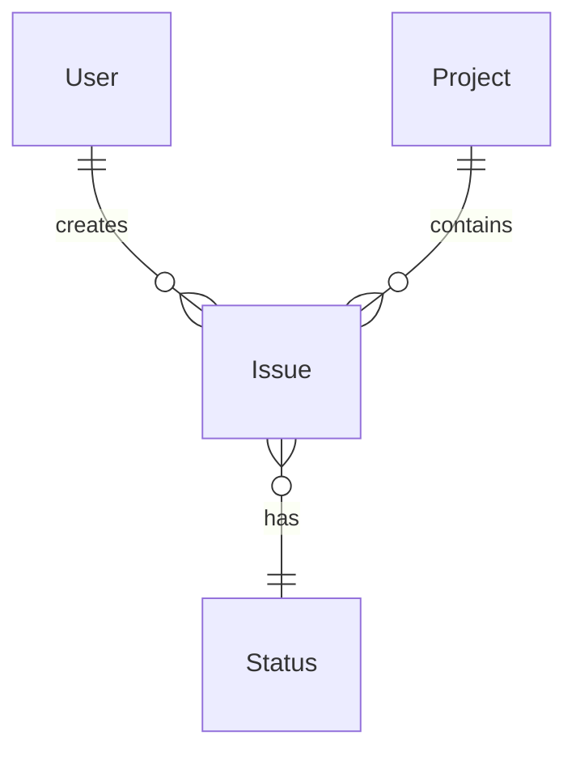
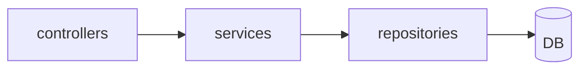
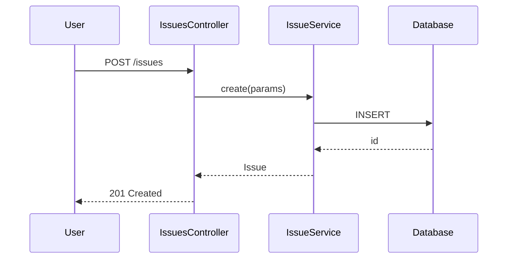
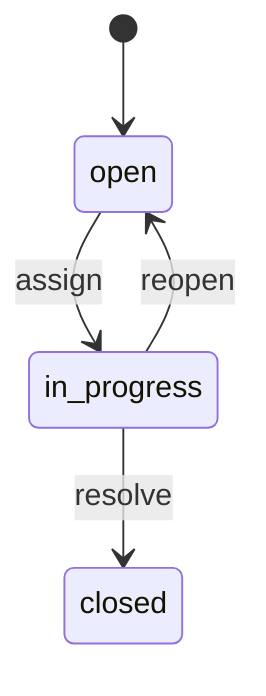

# Outline モード 言語別「概観テーブル」マッピング

cc-rsg の **outline モード**で生成する Layer 1（必ず全列挙される表）の定義集。
言語・フレームワークごとに「どの抽象を表として並べるか」「どの ripgrep パターンで全列挙するか」を定義する。

## 共通方針

### 全言語で生成する 5 種類の表（普遍的抽象）

| 表名 | 何を載せるか | 言語非依存の意味 |
|---|---|---|
| **Modules** | トップレベルの責務区分 | ディレクトリ / パッケージ |
| **Entities** | 「もの」を表す型 | model / struct / type / class / interface |
| **Actions** | 「振る舞い」を起こす境界 | controller / handler / view function / endpoint |
| **Data** | 永続化スキーマ | DB schema / migrations / collections |
| **Dependencies** | 外部依存 | gem / pip / npm / マイクロサービス連携 |

これら 5 種類は**どの言語・フレームワークでも必ず存在する抽象**で、outline 仕様書の骨格になる。

### Confidence ラベル必須（各表セル単位）

| Marker | 意味 | グラウンディング根拠 |
|---|---|---|
| 🟢 **VERIFIED** | `file_editor view` で実コードを目視確認した | view 履歴に当該ファイルあり |
| 🟡 **INFERRED** | ripgrep / import / 命名規則からの**機械抽出**で確認 | `rg` ヒット行を `[REF: path:Lstart-Lend]` で示せる |
| 🔴 **ASSUMED** | フレームワーク典型挙動からの推測（コード未確認） | 要 SME 確認、`[ASK SME]` マーカー併記 |

**🟢 と 🟡 はソース由来（信頼できる）。🔴 は agent の知識ベースのみ（要確認）**。

### MECE 検査基準（outline モード）

`scripts/coverage-check.py` が以下を機械チェック:

1. **全ファイル列挙**: ファイルツリー上の全ソースファイルが、いずれかの表の行 / 表セル / セクションに**必ず 1 回**出現
2. **VERIFIED 比率**: 全 entity 行のうち 🟢 ラベルが付いた割合（KPI として表示）
3. **🔴 ASSUMED 比率**: 60% を超えたら警告

---

## Ruby / Rails

### Modules table

| ディレクトリ | 役割 | 確認方法 |
|---|---|---|
| `app/models/` | ActiveRecord モデル | `glob 'app/models/**/*.rb'` |
| `app/controllers/` | コントローラ | `glob 'app/controllers/**/*.rb'` |
| `app/views/` | テンプレート | `glob 'app/views/**/*'` |
| `app/helpers/` | ビューヘルパー | `glob 'app/helpers/**/*.rb'` |
| `app/jobs/` | バックグラウンドジョブ | `glob 'app/jobs/**/*.rb'` |
| `app/mailers/` | メーラー | `glob 'app/mailers/**/*.rb'` |
| `lib/` | プロジェクト固有ライブラリ | `glob 'lib/**/*.rb'` |
| `config/` | 設定 | `glob 'config/**/*.{rb,yml}'` |
| `db/migrate/` | マイグレーション | `glob 'db/migrate/*.rb'` |
| `plugins/` or `engines/` | プラグイン / エンジン | `glob 'plugins/**/*' or 'engines/**/*'` |

### Entities table（Models）

抽出パターン:
```
rg "^class (\w+)" --type ruby app/models/ -o
```

カラム:

| Class | File | 親クラス | 主要 has_many / belongs_to | 概要 1 行 | 🟢/🟡/🔴 |
|---|---|---|---|---|---|

関連抽出:
```
rg "^\s+(has_many|belongs_to|has_one|has_and_belongs_to_many)\s+:(\w+)" --type ruby
```

### Actions table（Controllers × Actions）

```
rg "^class (\w+Controller)" --type ruby app/controllers/ -o
rg "^\s+def (\w+)" app/controllers/specific_controller.rb
```

ルーティング:
```
view config/routes.rb
```

カラム:

| Controller#action | HTTP method | path | callback / before_action | 概要 1 行 | 🟢/🟡/🔴 |
|---|---|---|---|---|---|

### Data table（DB Schema）

```
view db/schema.rb (もしくは config/database.yml で確認)
view db/migrate/ (重要マイグレーションだけ)
```

カラム:

| Table | 主要 columns | FK | インデックス | 1 行説明 | 🟢/🟡/🔴 |
|---|---|---|---|---|---|

### Dependencies table

```
view Gemfile
view Gemfile.lock (一覧確認)
```

| Gem | バージョン | 用途分類 | 接触点（ファイル / 行） | 🟢/🟡/🔴 |
|---|---|---|---|---|

---

## Python / Django

### Modules table

| ディレクトリ | 役割 |
|---|---|
| `<app>/models.py` または `<app>/models/` | Django モデル |
| `<app>/views.py` または `<app>/views/` | ビュー |
| `<app>/urls.py` | URL ルーティング |
| `<app>/serializers.py` | DRF シリアライザ |
| `<app>/admin.py` | 管理画面 |
| `<app>/management/commands/` | カスタムコマンド |
| `<project>/settings.py` | 設定 |
| `<app>/migrations/` | スキーマ移行 |

### Entities table（Models）

```
rg "^class (\w+)\(.*models\.Model.*\):" --type py
rg "^class (\w+)\(.*\):" --type py <app>/models/
```

カラム: Class / File / 親クラス / 主要 ForeignKey / Manager / 概要 / Confidence

### Actions table

Class-based views と function views の両方:
```
rg "^class (\w+)\(.*View.*\):" --type py
rg "^def (\w+)\(request" --type py
```

URLconf:
```
view <app>/urls.py
```

### Data table

Django の場合 `migrations/` の自動生成を順に追えば schema が見える。
- 最新 migration からモデル状態を逆算するか
- `python manage.py dbshell` 相当の出力例を skill 内で参照（実行不要）

---

## JavaScript / TypeScript / React

### Modules table

| ディレクトリ | 役割 |
|---|---|
| `src/pages/` または `src/app/` (Next.js) | ルート / ページ |
| `src/components/` | UI コンポーネント |
| `src/hooks/` | カスタムフック |
| `src/store/` または `src/state/` | 状態管理 |
| `src/lib/` または `src/utils/` | ユーティリティ |
| `src/api/` または `src/services/` | API 呼び出し |
| `public/` | 静的アセット |

### Entities table（React Components / Classes）

```
rg "^(?:export )?(?:default )?function (\w+)\s*\(" --type tsx
rg "^(?:export )?const (\w+)\s*=" --type tsx
rg "^(?:export )?class (\w+)" --type tsx
```

カラム: Component / File / props 主要 / state 主要 / hook 利用 / 概要 / Confidence

### Actions table（Routes / API endpoints）

Next.js App Router:
```
glob 'src/app/api/**/route.ts'
```

Express / Hono:
```
rg "(get|post|put|delete|patch)\(['\"]/" src/
```

### Data table

ORM 使用時（Prisma 等）:
```
view prisma/schema.prisma
```

State store（Zustand / Redux）も entities として別表化:
```
rg "create<.*>\(\(" src/store/
```

---

## Go

### Modules table

| ディレクトリ | 役割 |
|---|---|
| `cmd/` | エントリーポイント |
| `internal/` | プロジェクト内パッケージ |
| `pkg/` | 公開パッケージ |
| `api/` | API 定義 (OpenAPI / protobuf) |

### Entities table（Types）

```
rg "^type (\w+) struct" --type go
rg "^type (\w+) interface" --type go
```

カラム: Type / Kind (struct/interface) / File / Fields / Methods / 概要 / Confidence

### Actions table（Handlers）

```
rg "^func.*\((?:c|ctx|r|req).*\)\s*\{" --type go
```

ルーティング:
```
rg "(GET|POST|PUT|DELETE|PATCH)\(['\"]/" --type go
```

---

## Java / Kotlin (Spring Boot)

### Modules table

| ディレクトリ | 役割 |
|---|---|
| `src/main/java/**/controller/` | コントローラ |
| `src/main/java/**/service/` | サービス層 |
| `src/main/java/**/repository/` | リポジトリ |
| `src/main/java/**/entity/` または `**/model/` | エンティティ |
| `src/main/resources/` | 設定 / migrations |

### Entities table

```
rg "@Entity" -A1 --type java
rg "^(public )?class (\w+)" --type java
```

### Actions table

```
rg "@(RestController|Controller|RequestMapping|GetMapping|PostMapping)" --type java
```

---

## Mermaid 図のテンプレ

outline モードでは Layer 2 として以下を最低 1 枚ずつ生成:

### ER 図（Entities + Data table から自動生成）



### モジュール依存図



### シーケンス図（代表ユースケース 1〜3 本）



### 状態遷移図（典型 entity 1〜2 個）



---

## 深掘り候補（Layer 3）の選定基準

outline モードでは各表の末尾に **「深掘り候補」セクション**を必ず置く。agent は以下を優先的に候補に挙げる:

1. **🔴 ASSUMED 比率が高い行**（agent が確認できなかった ≒ 重要かもしれない）
2. **複雑度の高い行**（メソッド数が多い、関連数が多い、ファイル行数が多い）
3. **特殊な実装パターンを持つ行**（meta-programming、callback 多用、複雑なクエリ）
4. **ビジネス的に critical な行**（決済 / 認証 / 権限 / 監査ログ等のキーワードを含む）

候補リスト形式（ID 付き）:

```markdown
### 深掘り候補（番号で指示してください）

- **D-001**: M-013 `Issue` クラスの権限ガードロジック [🔴 ASSUMED, 複雑]
- **D-002**: C-018 `ProjectsController#index` の visibility 判定 [🟡 INFERRED, business-critical]
- **D-003**: シーケンス「Issue 通知配信」の subscribers 解決 [未検証, 複雑]
- **D-004**: 状態遷移「Issue#status` の transition validation [🔴 ASSUMED]
- **D-005**: dependencies「acts_as_searchable」の検索バックエンド [🟡 INFERRED]
```

ユーザーが `D-001 深掘りして` あるいは `Issue の権限を詳しく` と指示すると、main agent は該当 ID を recognize して chapter-investigator を起動する（Phase 6.5 参照）。
